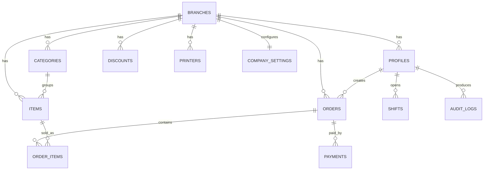

# Z-POS Enterprise Architecture

## System Architecture

Z-POS is a cloud POS built as a React 19 + TypeScript Vite application backed by Supabase Auth, PostgreSQL, Row Level Security, Storage, and RPC/Edge Function service boundaries.

Architecture style:

- Clean Architecture: `domain` has business types, `features` contains use cases and UI, `shared` contains infrastructure and primitives.
- Feature-based DDD: POS, auth, catalog, discounts, orders, users, reports, settings, audit.
- Repository pattern: each feature exposes database access through `*.repository.ts`.
- Service layer: business rules live in `*.service.ts`, such as POS discount and total calculation.
- Dependency direction: UI -> feature hooks/stores -> services/repositories -> Supabase.
- RBAC and RLS: frontend permissions guide UX; PostgreSQL policies enforce access.

## Folder Structure

```text
src/
  app/
    shell/
    App.tsx
    providers.tsx
    router.tsx
  domain/
    catalog/
    orders/
  features/
    audit/
    auth/
    catalog/
    dashboard/
    discounts/
    orders/
    pos/
    reports/
    settings/
    users/
  shared/
    lib/
    pages/
    ui/
  styles/
supabase/
  migrations/
docs/
```

## Component Hierarchy

```text
App
  AppProviders
    RouterProvider
      ProtectedRoute
        AppShell
          SidebarNavigation
          MobileNavigation
          Outlet
            PosPage
              ProductSearch
              ProductResults
              CartLines
              BillSummary
              PaymentSelector
            CatalogPage
            OrdersPage
            DashboardPage
            ReportsPage
```

## Route Structure

- `/login`: public login.
- `/reset-password`: public password recovery.
- `/pos`: admin/cashier billing.
- `/dashboard`: admin dashboard.
- `/catalog`: admin categories/items.
- `/discounts`: admin discount rules.
- `/orders`: admin all orders, cashier own orders.
- `/reports`: admin reports.
- `/users`: admin user management.
- `/settings`: admin company, branch, printer settings.
- `/audit-logs`: admin audit trail.

## Database Design

Core tables:

- `branches`
- `profiles`
- `user_permissions`
- `categories`
- `items`
- `discounts`
- `shifts`
- `orders`
- `order_items`
- `payments`
- `printers`
- `company_settings`
- `audit_logs`
- `offline_sync_events`
- `order_counters`

ER diagram:



The complete PostgreSQL schema, constraints, indexes, triggers, RPC functions, and RLS policies are in `supabase/migrations/001_initial_schema.sql`.

## Authentication Design

- Supabase Auth handles sessions, refresh tokens, password reset, and email identity.
- Password policy is enforced in frontend Zod schemas and should also be configured in Supabase Auth settings.
- Login rate limiting and account locking are represented by `profiles.failed_login_count` and `profiles.locked_until`; production enforcement belongs in Supabase Auth hooks or Edge Functions.
- Session timeout is enforced client-side with idle timers and server-side with Supabase JWT expiry.

## Authorization Design

Roles:

- `ADMIN`: full access.
- `CASHIER`: POS billing, own orders, payments, optionally reprint/manual discount via `user_permissions`.

Frontend:

- `ProtectedRoute` blocks screens by permission.
- `rbac.ts` centralizes permissions.

Backend:

- RLS policies enforce branch scoping.
- Admin policies allow management.
- Cashier policies restrict orders to own records.

## UI Wireframes

POS desktop/tablet:

```text
+----------------------------+----------------------+
| Search / barcode input     | Current Bill         |
| Product result grid        | Cart lines           |
|                            | Discounts            |
|                            | Totals               |
|                            | Cash/Card/Print      |
+----------------------------+----------------------+
```

Mobile:

```text
+----------------------+
| Search input         |
| Product results      |
| Current bill         |
| Totals + payment     |
| Bottom nav           |
+----------------------+
```

## Zustand Store Design

`usePosStore` owns only short-lived transaction state:

- cart lines
- active discount rules
- manual discount mode/value
- selected payment
- cart mutation actions

Server state stays in TanStack Query.

## Printing Architecture

- Receipt is generated only after payment succeeds and order save succeeds.
- Browser print fallback supports normal USB printers.
- Production thermal printing should use a local print bridge service for ESC/POS because browsers cannot reliably access raw printer commands.
- Supported printer settings are stored in `printers`.
- Reprint creates an `audit_logs` row with `RECEIPT_REPRINT`.

## Offline Sync Architecture

- Use IndexedDB for local order queue and receipt snapshots.
- Generate `offline_client_id` per offline order.
- Sync with Supabase when connectivity returns.
- `orders.unique(branch_id, offline_client_id)` prevents duplicate uploads.
- Conflict strategy: server order numbers win; client keeps local receipt ID until sync returns canonical order number.

## Catalog Caching

- POS product metadata is cached in `localStorage` for 24 hours.
- TanStack Query uses cached products as initial data and refreshes in the background.
- Product images are uploaded as compressed WebP files and served through browser HTTP cache.
- Creating a catalog item clears the active product cache so the POS refreshes with new products.

## Security Architecture

- Supabase Auth for identity.
- RLS for table access.
- RPC functions for privileged writes.
- Zod for input validation.
- Escaped React output by default; avoid `dangerouslySetInnerHTML`.
- Store masked card data only.
- Audit sensitive events.
- Use Sentry for production errors without storing PII.

## Deployment Architecture

- Vercel hosts the React app.
- Supabase hosts Auth, PostgreSQL, Storage, and Edge Functions.
- Sentry captures client errors.
- Supabase Storage stores item images with signed URLs or public bucket policy scoped to non-sensitive assets.

## Production Checklist

- Configure Supabase Auth password rules and JWT expiry.
- Apply migrations in staging, then production.
- Verify RLS with admin and cashier test accounts.
- Configure Vercel environment variables.
- Configure Sentry DSN and release tracking.
- Test offline queue idempotency.
- Test receipt printing for 58mm and 80mm layouts.
- Run Lighthouse and mobile usability checks.
- Back up database and define recovery objectives.

## Future Scalability Plan

- Add branch-level inventory and stock movement tables.
- Add kitchen display support for cafes and juice bars.
- Move report exports to Supabase Edge Functions.
- Add read replicas or materialized views for large reporting workloads.
- Add multi-register cash drawer reconciliation.
- Add centralized product catalog with branch-specific pricing.
